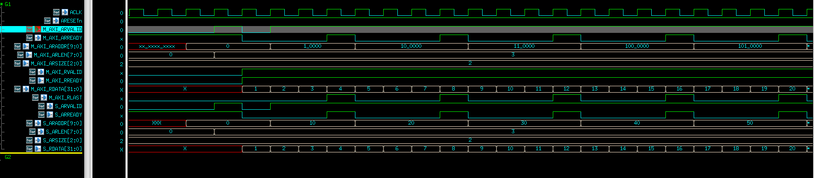
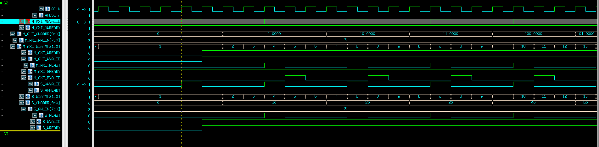

# AXI_high_throughput

### AXI Read Channel Waveform

The following waveform shows continuous AXI read burst transactions.

- The master issues back-to-back read bursts (`ARVALID` remains active).
- Each burst has `ARLEN = 3`.
- The slave returns data on every clock cycle (`RVALID` always high when `RREADY` is high).
- `RLAST` marks the final beat of each burst.
- This demonstrates maximum read throughput with no stalls.

## AXI Write Channel Waveform

The following waveform shows a high-throughput AXI write channel 

- The master issues **back-to-back burst write transactions** without idle cycles.
- Each burst has `AWLEN = 3`.
- `M_AXI_AWVALID`, and `M_AXI_WLAST` are in sync.
- As `M_AXI_AWREADY` and `M_AXI_WREADY` are continuously high.
- This results in a **write throughput of 1 beat per cycle**, achieving **maximum performance (throughput = 1)**.

test with  vcs -R -sverilog master_slave_tb.sv -full64 -debug_access+all
